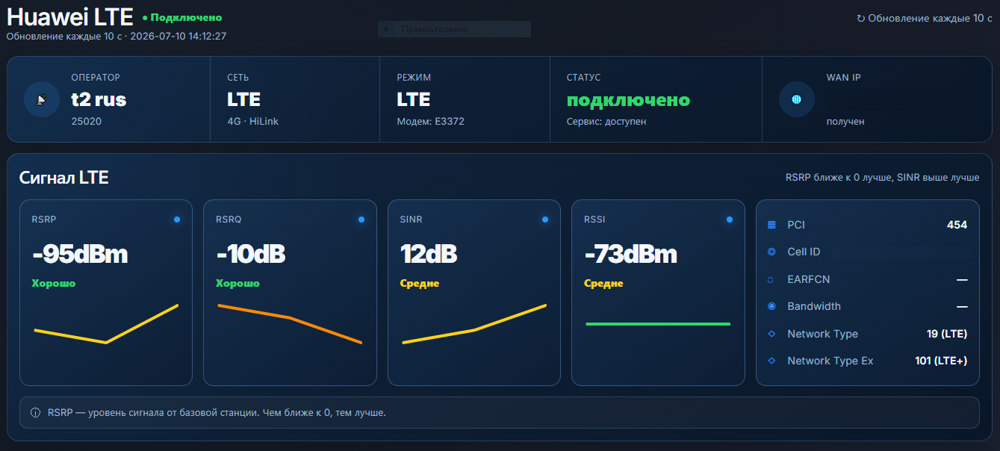
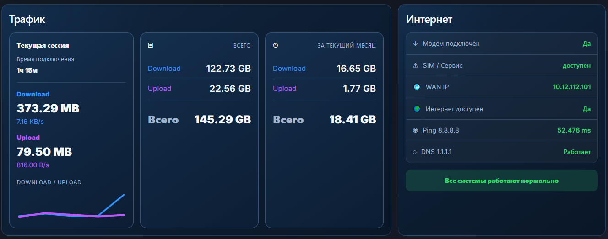
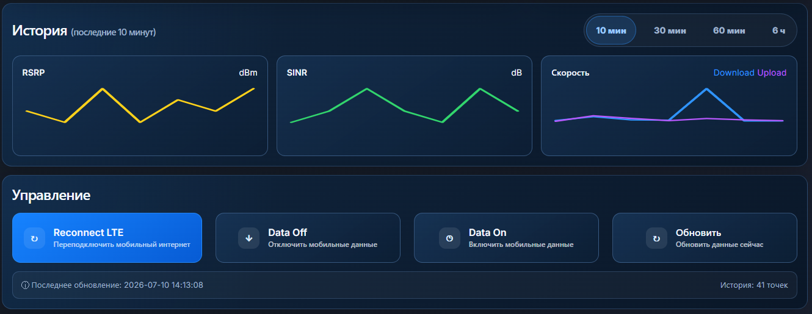

# Huawei HiLink LTE Status for LuCI

[](https://github.com/kucher13/luci-app-huawei-hilink-status/releases/latest)
[](https://github.com/kucher13/luci-app-huawei-hilink-status/actions/workflows/build.yml)
[](LICENSE)

<p align="center">
  <a href="docs/dashboard-top.png">
    
  </a>
</p>

<p align="center">
  <a href="docs/dashboard-traffic.png">
    
  </a>
</p>

<p align="center">
  <a href="docs/dashboard-history.png">
    
  </a>
</p>

A modern LuCI dashboard for Huawei HiLink LTE modems connected to an OpenWrt router.

The application displays LTE signal quality, operator and connection information, traffic statistics, connection health and history. It also provides basic modem controls directly from LuCI.

The interface automatically follows the selected LuCI language:

- Russian LuCI locale → Russian interface
- Any other LuCI locale → English interface

> Current stable release: **v1.0.0**  
> Tested on **OpenWrt 25.12.4**, target `mediatek/filogic`, with a Huawei HiLink modem at `192.168.8.1`.

## Features

- LTE signal metrics: **RSSI, RSRP, RSRQ and SINR**
- Operator, network type, work mode and connection status
- WAN address, SIM/service state and internet availability
- Current session, total and monthly traffic counters
- Download and upload speed history
- Signal history with selectable time range
- Connection health checks, ping and DNS status
- LTE reconnect, mobile data on/off and manual refresh controls
- Responsive dark LuCI interface
- Automatic Russian and English localization
- No project telemetry

## Requirements

- OpenWrt **25.12 or newer** using the `apk` package manager
- LuCI
- `rpcd-mod-file`
- `curl`
- A Huawei modem exposing the HiLink HTTP API
- Modem reachable from the router at `http://192.168.8.1`

Required package dependencies are declared by the APK and are installed automatically when available in the configured OpenWrt repositories.

## Quick installation

Run on the OpenWrt router over SSH:

```sh
cd /tmp && \
wget -O luci-app-huawei-hilink-status-1.0.0-r1.apk \
  https://github.com/kucher13/luci-app-huawei-hilink-status/releases/download/v1.0.0/luci-app-huawei-hilink-status-1.0.0-r1.apk && \
apk add --allow-untrusted ./luci-app-huawei-hilink-status-1.0.0-r1.apk
```

Then refresh LuCI and open **Huawei LTE** in the sidebar.

The package is built outside the official OpenWrt repositories, therefore installation uses `--allow-untrusted`.

## Verify the downloaded package

The release contains `SHA256SUMS` next to the APK:

```sh
cd /tmp

wget -O luci-app-huawei-hilink-status-1.0.0-r1.apk \
  https://github.com/kucher13/luci-app-huawei-hilink-status/releases/download/v1.0.0/luci-app-huawei-hilink-status-1.0.0-r1.apk

wget -O SHA256SUMS \
  https://github.com/kucher13/luci-app-huawei-hilink-status/releases/download/v1.0.0/SHA256SUMS

sha256sum -c SHA256SUMS
```

Expected checksum for v1.0.0:

```text
c5e0de54bb0ecb78e341cae76eea250c1f5530b5082277b260a86017fa1d8a0e
```

## Upgrade

Download the newer APK from **Releases** and install it over the existing package:

```sh
apk add --allow-untrusted /tmp/luci-app-huawei-hilink-status-NEW_VERSION.apk
```

The package manager replaces the files owned by the previous version.

## Uninstall

```sh
apk del luci-app-huawei-hilink-status
```

## Useful diagnostics

Show the installed version:

```sh
apk list -I | grep '^luci-app-huawei-hilink-status'
```

Show all files owned by the package:

```sh
apk info -L luci-app-huawei-hilink-status
```

Test the backend directly:

```sh
/usr/bin/huawei json
```

Test whether the modem API is reachable:

```sh
curl -s --connect-timeout 3 http://192.168.8.1/api/device/information
```

Clear LuCI caches and restart services if the menu does not appear:

```sh
rm -f /tmp/luci-indexcache* /tmp/luci-modulecache*
/etc/init.d/rpcd restart
/etc/init.d/uhttpd restart
```

## Modem address

The packaged LuCI interface currently expects the Huawei HiLink modem at:

```text
http://192.168.8.1
```

The backend supports the `HUAWEI_BASE` environment variable for direct command-line testing, but a persistent modem-address setting is not yet exposed in LuCI.

Example:

```sh
HUAWEI_BASE=http://192.168.9.1 /usr/bin/huawei json
```

## Compatibility notes

The project is intended for Huawei modems running HiLink firmware and exposing an HTTP/XML API.

It is not intended for modems operating only as a serial device, stick mode, PPP modem or MBIM/QMI device without the HiLink web API.

Huawei API responses vary between modem models and firmware versions, so compatibility with every device cannot be guaranteed. Reports and tested-device information are welcome in [Issues](https://github.com/kucher13/luci-app-huawei-hilink-status/issues).

## Build on Ubuntu

The included script downloads the matching OpenWrt SDK, installs feeds, builds the package and writes the result to `result/`:

```sh
git clone https://github.com/kucher13/luci-app-huawei-hilink-status.git
cd luci-app-huawei-hilink-status
chmod +x build-on-ubuntu.sh
./build-on-ubuntu.sh
```

Build output:

```text
result/luci-app-huawei-hilink-status-*.apk
result/SHA256SUMS
```

Default build target:

```text
OpenWrt: 25.12.4
target:  mediatek
subtarget: filogic
```

The defaults can be overridden with environment variables supported by `build-on-ubuntu.sh`.

## Build inside an OpenWrt SDK or source tree

Copy or clone the repository into:

```text
package/luci-app-huawei-hilink-status
```

Then run:

```sh
./scripts/feeds update -a
./scripts/feeds install -a
make defconfig
make package/luci-app-huawei-hilink-status/compile V=s
```

## Project structure

```text
Makefile
build-on-ubuntu.sh
docs/
├── dashboard-top.png
├── dashboard-traffic.png
└── dashboard-history.png
files/
├── usr/bin/huawei
├── usr/share/luci/menu.d/luci-app-huawei-lte.json
├── usr/share/rpcd/acl.d/luci-app-huawei-lte.json
└── www/luci-static/resources/view/huawei/lte_clean.js
```

During package build, `lte_clean.js` is installed directly as the LuCI JavaScript view.

## Privacy

The application does not include project analytics or telemetry. Modem information is requested locally from the Huawei HiLink API.

Internet-health checks may contact the configured public ping and DNS test endpoints, currently including `8.8.8.8` and `1.1.1.1`.

---

# Русский

`luci-app-huawei-hilink-status` — это современная страница LuCI для контроля LTE-модема Huawei HiLink.

Она показывает:

- параметры сигнала RSSI, RSRP, RSRQ и SINR;
- оператора, режим сети и состояние подключения;
- текущий, общий и месячный трафик;
- историю сигнала и скорости;
- состояние интернета, ping и DNS;
- кнопки переподключения LTE и управления мобильными данными.

Язык страницы выбирается автоматически по языку LuCI.

## Быстрая установка

```sh
cd /tmp && \
wget -O luci-app-huawei-hilink-status-1.0.0-r1.apk \
  https://github.com/kucher13/luci-app-huawei-hilink-status/releases/download/v1.0.0/luci-app-huawei-hilink-status-1.0.0-r1.apk && \
apk add --allow-untrusted ./luci-app-huawei-hilink-status-1.0.0-r1.apk
```

После установки обновите страницу LuCI и откройте раздел **Huawei LTE**.

Удаление:

```sh
apk del luci-app-huawei-hilink-status
```

При проблемах выполните:

```sh
/usr/bin/huawei json
```

и проверьте доступность модема по адресу:

```text
http://192.168.8.1
```

## License

MIT — see [LICENSE](LICENSE).
